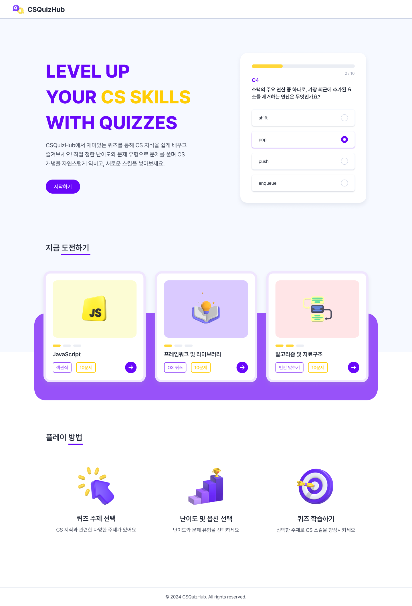

# CSQuizHub

<div align="center">
  <a href="https://cs-quiz-xi.vercel.app/">
    
  </a>
</div></br>

<div align="center">
  <p><strong>CS 지식을 재미있게 학습할 수 없을까?</strong></p>
  <p><a href="https://cs-quiz-xi.vercel.app/">CSQuizHub</a>에서는 직접 정한 난이도와 문제 유형으로 CS 개념을 쉽고 재미있게 즐길 수 있습니다.</p>
</div>

</br>

## 목차

- [Demo](#demo)
  - [이용 가이드](#이용-가이드) 
- [사용 기술](#사용-기술)
- [설치 및 실행](#설치-및-실행)
- [기능](#기능)
- [코딩 컨벤션](#코딩-컨벤션)
  - [파일 및 폴더 구조](#파일-및-폴더-구조)
  - [React/TypeScript](#reacttypescript)
  - [네이밍 규칙](#네이밍-규칙)
  - [커밋 메시지](#커밋-메시지)
- [프로젝트 관리](#프로젝트-관리)

</br>

## Demo
https://cs-quiz-xi.vercel.app/

</br>

<div align="center">
  
</div>

</br>

### 이용 가이드

1. 시작하기 -> 퀴즈 주제 선택
 - 원하는 난이도, 문제 수, 문제 유형을 선택하세요.
 - AI가 자동으로 문제를 생성합니다.
 - 퀴즈를 풀고 정답을 확인하세요.
2. 메인 페이지의 '지금 도전하기'에서 카드 선택 후, 바로 퀴즈를 풀어보세요.
   
</br>

## 사용 기술

[](https://skillicons.dev)

- Zustand (상태 관리)
- Storybook (컴포넌트 문서화)
- ESLint, Prettier (코드 품질 관리)

</br>

## 설치 및 실행

1. 저장소를 복제합니다.
```zsh
> git clone https://github.com/nxnaxx/cs-quiz.git
```

2. 의존성을 설치합니다.
```zsh
> yarn install
```

3. OpenAI key를 발급받습니다.
https://platform.openai.com/docs/overview

5. root directory에 .env파일을 생성하고 아래와 같이 작성합니다.
```
// .env
VITE_OPENAI_API_KEY={발급받은 api key}
```

5. 개발 서버를 실행합니다.
```zsh
> yarn dev
```

*참고: 브라우저에서 `http://localhost:5173`을 통해 프로젝트를 실행할 수 있습니다.

</br>

## 기능

- AI 기반 자동 퀴즈 생성
- 유저가 선택한 옵션으로 맞춤형 퀴즈 생성
  - 난이도 설정(쉬움, 보통, 어려움) 
  - 다양한 문제 유형(객관식, OX 퀴즈, 빈칸 맞추기)
  - 문제 수(5문제, 10문제, 15문제)
- 문제 풀이 후, 결과 확인
  - 퀴즈 정답과 설명 포함

</br>

## 코딩 컨벤션

### 파일 및 폴더 구조

- **컴포넌트**: PascalCase (e.g. Button.tsx)
- **유틸리티 함수, 데이터, 타입, 스토어, 훅**: camelCase (e.g. quizData.ts, useQuizStore.ts)
- Atomic Design 패턴

```
- public/
  - assets/icons/
  - assets/images/
- src/
  - __mocks__: 더미 데이터
  - components/
    - atoms/
    - molecules/
    - organisms/
    - templates/
  - data/: 데이터 관리 파일
  - hooks/: custom React hook
  - pages/: 각 페이지별로 사용하는 컴포넌트
  - services/: API 호출 또는 비즈니스 로직과 관련된 서비스
  - store/: 상태 관리 관련 파일 (Zustand 스토어 파일)
  - styles/: 전역 스타일과 공용 스타일 정의 (e.g. globalStyle, mixin)
  - types/: TypeScript 타입 정의
  - utils/: 유틸리티 함수
```

</br>

### React/TypeScript

- **Component**: 함수형 컴포넌트를 기본으로 사용합니다.
- **Props type 정의**: interface를 사용하여 Props를 정의합니다.
- **Event Handler**: `on` 접두어를 사용합니다.

```tsx
interface ButtonProps {
  label: string;
  onClick: MouseEventHandler<HTMLButtonElement>;
}

export default function Button({ label, onClick }: ButtonProps) {
  return <button onClick={onClick}>{label}</button>;
}
```

</br>

### 네이밍 규칙

- **변수명**: camelCase를 사용합니다.
- **컴포넌트명**: React 컴포넌트는 PascalCase로 작성합니다.
- **함수명**: 동작을 나타내는 명확한 동사로 시작합니다. (e.g. handleButtonClick)

</br>

### 커밋 메시지

커밋 메시지는 영어로 작성하고, `<type>: <message>` 형식을 준수합니다.

- `feat`: 새로운 기능 추가
- `fix`: 버그 수정
- `refactor`: 코드 리팩터링
- `docs`: 문서 수정
- `perf`: 성능 최적화
- `chore`: 빌드 설정 또는 프로젝트 환경 관련 작업

</br>

## 프로젝트 관리

[](<https://www.figma.com/design/pzPLL4qA4hk81vvehvSzk1/CSQuizHub-(%EA%B0%9C%EC%9D%B8)?node-id=0-1&t=6czbNA3VTsTln9y6-1>)
