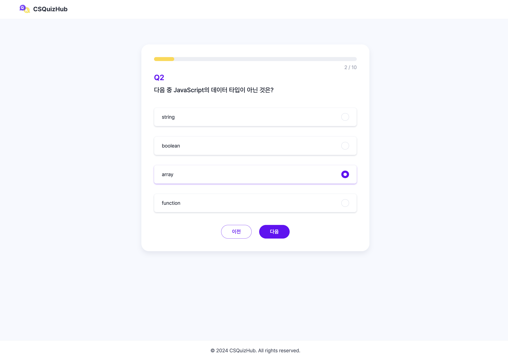

# CSQuizHub

  

 

  
<strong>CS 지식을 재미있게 학습할 수 없을까?</strong>

  
CSQuizHub에서는 직접 정한 난이도와 문제 유형으로 CS 개념을 쉽고 재미있게 즐길 수 있습니다.

 

|  |
| ----------------------------------------- |

 

## 목차

- [구현 사항](#구현-사항)
  - [주제 선택 페이지](#주제-선택-페이지)
  - [퀴즈 페이지](#퀴즈-페이지)
  - [퀴즈 결과 페이지](#퀴즈-결과-페이지)
- [사용 기술 및 도구](#사용-기술-및-도구)
- [프로젝트 관리](#프로젝트-관리)

 

## 구현 사항

### 주제 선택 페이지

|     |
| ----------------------------------------------- |
|         |
|  |

- 디자인 수정 (brand color, thumbnail image, 메인 페이지 etc.)
- 메인 페이지 구현, 주제 선택 페이지 구현
- 시작하기 버튼 클릭 시 주제 선택 페이지 이동
- 주제 선택 시 옵션(난이도, 문제 수, 문제 유형) 선택 modal 표시
  - modal 오픈 시 외부 스크롤 방지
  - modal 외부 클릭 또는 close button 클릭 시 modal 닫기
  - 옵션 선택 시 해당 값으로 상태 변경
  - 옵션 변경 후, 퀴즈 생성하지 않고 modal 닫을 시 옵션 전체 초기화

 

### 퀴즈 페이지

|      |
| ---------------------------------------------------------- |
|          |
|  |

- 더미 데이터 사용 (추후 실제 데이터 반영 예정)
- 퀴즈 진행 상황 표시 progress bar
- option 클릭 또는 answer 입력 시 해당 답변 저장
- 이전, 다음 버튼으로 이전 순서 퀴즈, 다음 순서 퀴즈 이동
  - 현재 문제가 첫 번째인 경우, 이전 버튼 비활성화
  - 현재 문제가 마지막인 경우, 제출 버튼 활성화
- 다음 퀴즈로 이동했다가 다시 이전 퀴즈로 이동하여도 이전에 저장된 값 표시

 

|  |
| ------------------------------------------- |

- 객관식, OX 퀴즈 문제에서 답변을 선택하지 않았을 경우, 다음 퀴즈로 이동 불가 및 validation 메시지 표시
- 빈칸 맞추기 문제는 빈값 허용

 

### 퀴즈 결과 페이지

|      |
| ----------------------------------------------------------- |
|          |
|  |

- 퀴즈 주제와 난이도 표시
- 퀴즈 점수 표시
- 정답인 경우, 정답과 추가 설명 표시
- 오답인 경우, 유저가 선택(작성)한 오답과 정답, 추가 설명 표시
  - OX 퀴즈 문제 또는 빈칸 채우기 문제에서 답변을 입력하지 않았을 경우에는 정답과 추가 설명만 표시

 

## 해결 과제

- 메인 페이지 quiz card 선택 시 기본 설정된 option으로 퀴즈 생성
- ~~퀴즈 생성 페이지~~
- ~~퀴즈 결과 페이지~~
- 실제 데이터 연결
- 반응형 구현

 

## 사용 기술 및 도구

- Storybook(컴포넌트 개발)
- Zustand(상태 관리)

 

## 프로젝트 관리

?node-id=0-1&t=6czbNA3VTsTln9y6-1>)
